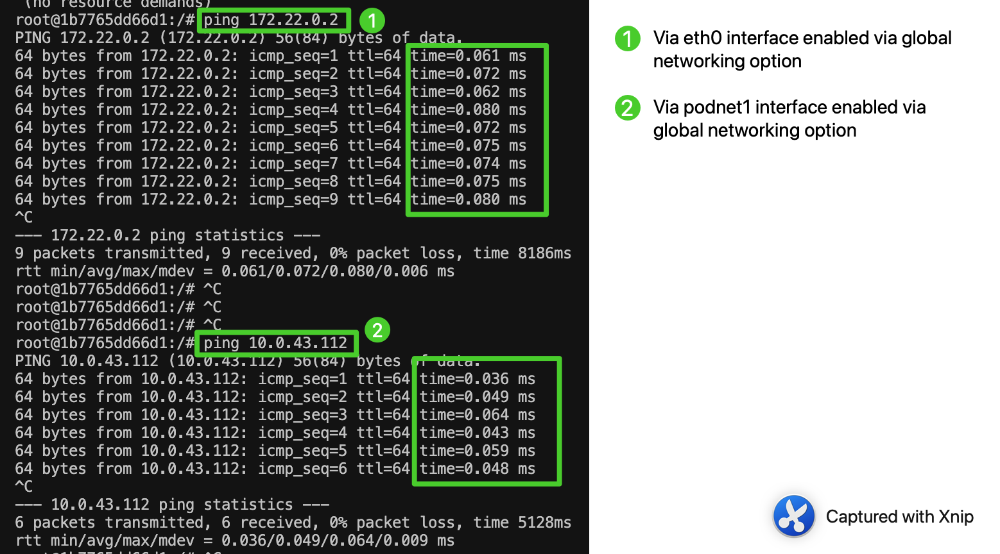
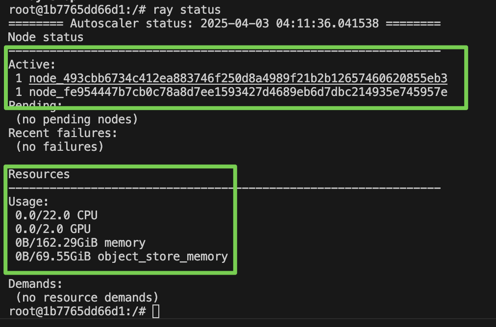

# Ray AWS and Runpod Cluster Setup & Commands

This guide provides step-by-step commands and tips to manage a Ray cluster on AWS or Runpod using the Ray Autoscaler and Docker containers. This includes additonal debugging tips and understanding of how ray works under the hood on AWS by building on [Offical Ray AWS guide](https://docs.ray.io/en/latest/cluster/vms/user-guides/launching-clusters/aws.html) and [Huggingfaceext classifier](https://docs.ray.io/en/latest/train/examples/transformers/transformers_torch_trainer_basic.html#transformers-torch-trainer-basic-example). Since runpod cluster setup is not offered out of the box by Ray, we can use on prem way of setting up Ray without containers. This allows us to understand the inner workings of how ray connects nodes manually to run scripts in a distributed manner.


## AWS Cluster Setup with Containers

🚀 Getting Started

✅ Launch the Cluster
Make sure your example-full.yaml is configured and run:
```
ray up ./example-full.yaml
```

💠 Useful Ray Commands

🔴 Terminate the Cluster
```
ray down ./example-full.yaml
```

🌐 Get the Cluster Head IP
```
ray get-head-ip ./example-full.yaml
```

📊 Port-Forward Ray Dashboard - default port: 8265
```
ray dashboard ./example-full.yaml
```
Then open: http://localhost:8265

📦 Submit a Job to the Cluster

In a new terminal:

ray job submit --address http://localhost:8265 --working-dir . -- python my_script.py

🔧 SSH into the Head Node
```
ray attach ./example-full.yaml
```
However, this is limitted to head node.

### Manual SSH setup
To access any node from local computer, add keys manually:

For this to work, we would need to create a keypair from AWS so that AWS has the public key and we can download the private key with .pem extension and place it in a local path such as ./local/rayscaler.pem.


The example-full.yaml file should have reference. So, add reference to the .pem file in example-full.yaml and the name of the keypair (e.g. "Rayscaler") to both head worker node config:


After using ```ray up ray up example-full.yaml```, you should see all nodes referencing keypair (e.g. "Rayscaler").


Now you can ssh into any node based on their public address given here on the ec2 info page:


SSH into the Worker or Head Node
```
ssh -i "./local/rayscaler.pem" ubuntu@<publicaddress>
```

🐳 Docker Container Debugging

🔍 Inspect Container Status
```
docker ps -a               # Is the container running?
docker logs ray_container  # Any startup logs/errors?
```

📦 Start Ray Docker Container (GPU)
```
nohup docker run -d --gpus all --name ray_container rayproject/ray-ml:latest-gpu sleep infinity >> dockerc.log 2>&1 &
```


Since ray is running **within** containers named ray_container, we have to enter the containers before checking for ray status which indicates which nodes are already added to the cluster and the total GPU and CPU power of this cluster:

👤 Enter the Running Container
```
docker exec -it ray_container bash
```


to submit a ray job, start dashboard on port 8265:
```
ray dashboard ./example-full.yaml
```

submit job via dashboard locally:
```
ray job submit --address http://localhost:8265 --working-dir . -- python trainingscripts/huggingfaceclassfier.py
```

to stop a ray job:
```
ray job stop <job_id> --address http://localhost:<dashboard-port>
```

📊 Monitor Autoscaling
```
ray exec ./example-full.yaml 'tail -n 100 -f /tmp/ray/session_latest/logs/monitor*'
```


⚙️ Ray Runtime Control

When using 'rayproject/ray-ml:latest-gpu' image for containers, these commands are run within in the containers to start ray runtime on head and worker nodes respectively:


## Running Ray without containers

Ensure that both nodes are pingable from each other. In order for reachability between nodes, they need to be located in the same subnet and security group in same region as stated in example-full.yaml file:


SSH into the Worker node:
```
ssh -i "./local/rayscaler.pem" ubuntu@<publicaddress>
```

Find private ip of head node:


Ping private ip of head from worker node:
```
ping <headprivateaddress>
```

You should see this:

This indicates **low latency** and good connection between the nodes with around 0.257ms to transmit packets.

Example of higher latency(0.700ms to transmit packets) that will result in longer training time:


▶️ Start Ray Head Node
```
nohup ray start --head --port=6379 --object-manager-port=8076 \
  --autoscaling-config=~/ray_bootstrap_config.yaml \
  --dashboard-host=0.0.0.0 >> install.log 2>&1 &
```

▶️ Start Ray Worker Node
```
ray start --address=172.31.1.20:6379 --object-manager-port=8076
```


## Training Scripts

In order to distribute the data and training process to different gpus we can make use of Ray configuration objects like ScalingConfig, RunConfig, etc. By stating **workers = 3**, it triggers 3 worker nodes to be used with GPU used in all with **use_GPU = True**. 

Script modification:


Initial logs of training will perform ping on each node to see if they are reachable from each other:


On dashboard, toggle to job page of job being run and find actors being used:


Training Completed!🤩


# Runpod Manual Setup without containers

This outlines the steps to set up a distributed Ray cluster with Hugging Face support on RunPod instances. It includes environment setup, network configuration, and useful commands.

📦 Python and System Package Installation for each node

Install necessary Python packages:
```
pip install ray transformers datasets evaluate ray[train] pandas ray[default] scikit-learn transformers[torch] 'accelerate>=0.26.0'
```

Install useful system utilities:
```
apt update && apt install -y lsof vim iputils-ping netcat redis-server
```


🌐 IP Setup and SSH (Per Node)

Generate private and public key on local computer using this guide: https://git-scm.com/book/en/v2/Git-on-the-Server-Generating-Your-SSH-Public-Key. 

Place public key in settings ssh tab:


Head Node (example: 172.23.0.2)
```
ssh eysfrdqrjotk7g-64410e75@ssh.runpod.io -i <local_private_key_location>
ip addr | grep inet

```
Worker Node 1
```
ssh mpmalwyl5c5yoi-64410e75@ssh.runpod.io -i <local_private_key_location>
```
Run this on all nodes to find interfaces and associated IP that can be used to connecting to headnode:
```
ip addr | grep inet
```
This should give these relevant global interfaces (i.e. eth0 or podnet1) and IPs


Perform a ping test from worker node to head IP as shown below for different interfaces. The below test shows podnet1 connection is faster:



📁 Environment Variables (All Pods)

Set shared environment variables:
```
export MASTER_ADDR=172.22.0.2
export MASTER_PORT=33
export NCCL_SOCKET_IFNAME=eth0
export NCCL_IB_DISABLE=1
export NCCL_DEBUG=INFO
export HF_HOME=/workspace/hf_cache
export TRANSFORMERS_CACHE=/workspace/hf_cache
export HF_DATASETS_CACHE=/workspace/hf_cache
```

Optional Hugging Face cache tricks:
```
rm -rf ~/.cache/huggingface
ln -s /workspace/hf_cache ~/.cache/huggingface
```

Check environment variable settings:
```
echo "HF_HOME=$HF_HOME, TRANSFORMERS_CACHE=$TRANSFORMERS_CACHE, HF_DATASETS_CACHE=$HF_DATASETS_CACHE"
echo "MASTER_ADDR=$MASTER_ADDR"
echo "MASTER_PORT=$MASTER_PORT"
echo "NCCL_SOCKET_IFNAME=$NCCL_SOCKET_IFNAME"
```


## Ray Cluster Setup

### Step-by-Step Actions:

| Step | Node        | Action                                                                                       |
|------|-------------|----------------------------------------------------------------------------------------------|
| 1    | Head Node   | `ray start --head --node-ip-address=<head_private_ip_address> --port=33 --include-dashboard=True --dashboard-host=0.0.0.0 --dashboard-port=8265` |
| 2    | Worker Node | `ray start --address=<head_private_ip_address>:33`                                                          |
| 3    | All Pods    | Set `MASTER_ADDR`, `MASTER_PORT`, `NCCL_SOCKET_IFNAME` as above                             |
| 4    | Worker Node | Test connection: `nc -zv <head_private_ip_address> 33` or `nc -zv 4pimh07ke0o6a3.runpod.internal 33`        |

---

Check ray status:



After starting ray, you should be able to see ray dashboard from head node:


🚀 Running Training Scripts

Run any training script using:
```
nohup python huggingfaceclassfier.py > scriptlogs.log 2>&1 &
```

Find latest logs with:
```
tail -f scriptlogs.log
```

Sample starting logs showing nodes connecting well with each other:


Sample logs showing nodes being unable to connect with each other - perform above ping tests to troubleshoot:


Check on runpod dashboard for gpu usage when script is running:


Happy Distributed Training! 🚀

